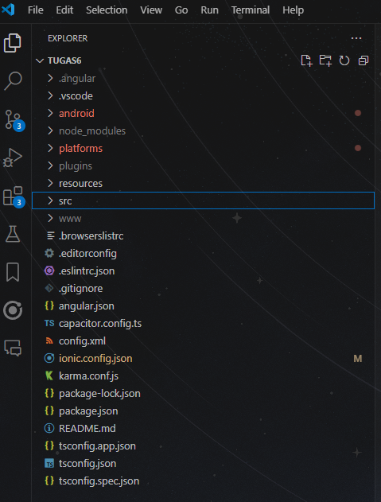
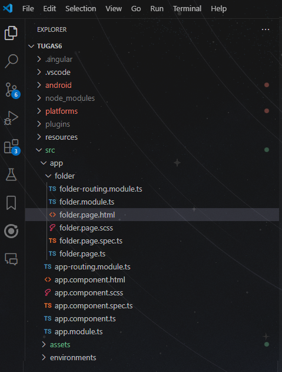

# PrakPemmobMinggu7

## Cara menambahkan komponen pada Ionic

1. Buka proyek Ionic pada VS Code

2. Pilih file yang akan ditambahkan komponen (pada contoh sekarang yaitu pada src/app/folder/folder.page.html)

3. Buka dokumentasi Ionic di https://ionicframework.com/docs/components untuk melihat daftar komponen.
4. Pilih komponen yang diinginkan
5. Salin kode dari dokumentasi dan tempelkan di yang dipilih.
6. Periksa kembali apabila dibutuhkan perubahan pada .scss maupun TS
7. Jalankan proyek Ionic dengan perintah ionic s untuk melihat hasilnya pada browser.

## Demo Aplikasi
